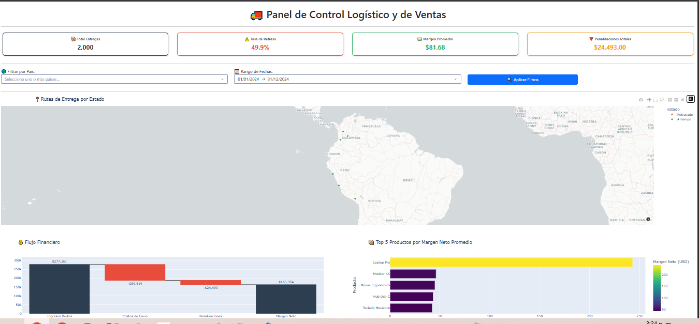
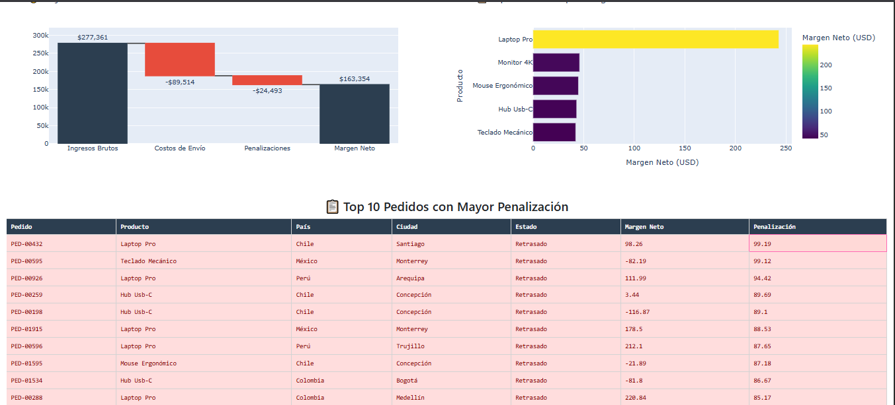

# 🚚 Panel de Control Logístico y de Ventas - LogiTech Distribution

Dashboard interactivo para monitorear operaciones logísticas y financieras. 

Desarrollado con Python, Dash, Plotly y Pandas como proyecto de portafolio para demostrar habilidades en análisis de datos, limpieza de información, visualización y desarrollo de aplicaciones web.

---

## 🌐 Dashboard en Vivo

🚀 **[Clic aquí para interactuar con el Dashboard en Render](https://logitech-dashboard.onrender.com/)**

> 💡 **Nota:** Al utilizar el plan gratuito de Render, la aplicación puede tardar cerca de 1 minuto en cargar la primera vez mientras el servidor se activa.

---

## 📸 Vista Previa

### 🏠 Dashboard principal



El dashboard principal permite visualizar los principales indicadores logísticos y financieros de la operación, incluyendo:

- Total de entregas.
- Tasa de retraso.
- Margen promedio.
- Penalizaciones totales.
- Rutas de entrega.
- Filtros por país.
- Filtros por rango de fechas.

---

### 📊 Detalle financiero y productos



La sección de análisis permite observar:

- Flujo financiero.
- Ingresos brutos.
- Costos de envío.
- Penalizaciones.
- Margen neto.
- Productos con mayor margen.
- Pedidos con mayores penalizaciones.

---

# 🎯 Problema de Negocio

**LogiTech Distribution** enfrenta una disminución en sus márgenes netos sin identificar claramente las causas.

La gerencia necesita analizar la información logística y financiera para responder preguntas como:

- ¿Dónde se están produciendo los retrasos?
- ¿Qué países presentan mayores problemas logísticos?
- ¿Qué productos generan mayor margen?
- ¿Qué pedidos tienen mayores penalizaciones?
- ¿Cómo afectan los costos de envío y las penalizaciones al margen neto?

El objetivo del proyecto es transformar los datos de las entregas en información útil para apoyar la toma de decisiones.

---

# ✅ Solución Implementada

Se desarrolló un dashboard web interactivo capaz de integrar datos logísticos y financieros y presentarlos mediante diferentes visualizaciones.

El dashboard permite:

- 📍 Visualizar las rutas de entrega mediante un mapa interactivo.
- 📊 Consultar KPIs principales.
- 🔍 Filtrar información por país.
- 📅 Filtrar información por rango de fechas.
- 💰 Analizar el flujo financiero mediante un gráfico de cascada.
- 📦 Identificar los productos con mayor margen neto.
- 📋 Consultar los pedidos con mayores penalizaciones.
- ⚠️ Identificar entregas retrasadas.

---

# 🛠️ Tecnologías Utilizadas

| Herramienta | Propósito |
|---|---|
| **Python 3** | Lenguaje principal del proyecto |
| **Pandas** | Limpieza, transformación y análisis de datos |
| **NumPy** | Operaciones y procesamiento numérico |
| **Jupyter Notebook** | Documentación del proceso ETL y análisis exploratorio |
| **Dash** | Desarrollo de la aplicación web interactiva |
| **Plotly** | Visualizaciones y gráficos interactivos |
| **Bootstrap** | Diseño visual y componentes responsivos |
| **Git** | Control de versiones |
| **GitHub** | Almacenamiento y publicación del código |
| **Render** | Despliegue de la aplicación en la nube |

---

# 📂 Estructura del Proyecto

```text
logitech-dashboard/
│
├── dashboard/
│   ├── app.py
│   ├── callbacks.py
│   ├── components.py
│   ├── data_loader.py
│   └── assets/
│
├── data/
│   ├── generar_datos.py
│   ├── entregas_sucias.csv
│   └── entregas_limpias.csv
│
├── notebooks/
│   └── limpieza_datos.ipynb
│
├── screenshots/
│   ├── dashboard-principal.png.png
│   └── dashboard-detalle.png.png
│
├── .gitignore
├── requirements.txt
└── README.md

📊 Proceso de Datos: ETL + EDA

El proyecto se dividió en varias etapas para convertir los datos originales en información útil para el dashboard.

1. Generación de Datos Sintéticos

Se generó un dataset de 2.000 registros de entregas correspondientes a diferentes países de Latinoamérica:

🇨🇴 Colombia
🇲🇽 México
🇨🇱 Chile
🇵🇪 Perú

El dataset inicial contiene diferentes variables relacionadas con:

Pedidos.
Fechas.
Países.
Productos.
Ciudades.
Días previstos.
Días reales.
Costos de envío.
Ingresos.
Penalizaciones.
Estado de entrega.
Coordenadas geográficas.

También se introdujeron errores intencionales para simular una situación real de datos.

2. Limpieza de Datos

La limpieza se realizó utilizando Pandas y se documentó en:
notebooks/limpieza_datos.ipynb
Entre las tareas realizadas se encuentran:

📅 Conversión de fechas

Se identificaron formatos de fecha y se transformaron a un formato de fecha reconocido por Pandas.

Esto permite realizar posteriormente operaciones como:

Filtrar por fechas.
Ordenar registros.
Analizar períodos.
Crear gráficos temporales.
❌ Identificación de valores nulos

Se utilizaron funciones como:

df.isnull().sum()

para identificar valores faltantes.

En el dataset se encontraron 58 valores nulos en la columna:

dias_reales

Esto representa información faltante relacionada con los días reales de entrega.

🔎 Análisis de valores faltantes

También se analizó la relación entre los valores faltantes y el estado de la entrega:

df[df["dias_reales"].isnull()]["estado"].value_counts()

El resultado permitió observar:

A tiempo     30
Retrasado    28

Esto ayudó a comprobar que los valores faltantes estaban distribuidos entre ambos estados.

🧹 Normalización de datos

Se realizaron procesos de limpieza y normalización para obtener datos consistentes antes de utilizarlos en el análisis y el dashboard.

🔄 Transformación de Datos

Después de limpiar los datos se realizaron transformaciones para generar nuevas variables útiles para el análisis.

Una de las principales métricas calculadas fue el:

💰 Margen Neto
Margen Neto = Ingreso de Venta - Costo de Envío - Penalización

Esta métrica permite conocer cuánto dinero queda después de descontar los principales costos asociados a cada entrega.

🔬 Análisis Exploratorio de Datos — EDA

El análisis exploratorio permitió conocer el comportamiento general de los datos antes de construir el dashboard.

Entre los principales resultados se identificaron:

📦 Total de entregas
2.000 entregas
⚠️ Tasa de retraso
49,9%
💰 Penalizaciones totales
$24.493
📈 Margen

Se analizaron los productos y pedidos para identificar cuáles generan mayores márgenes y cuáles presentan pérdidas.

📊 Visualizaciones

El dashboard utiliza diferentes tipos de visualizaciones.

🗺️ Mapa de entregas

Permite visualizar geográficamente las entregas y distinguir entre:

Entregas a tiempo.
Entregas retrasadas.

Esto facilita identificar zonas donde pueden existir problemas logísticos.

💰 Flujo Financiero

Se utiliza un gráfico de cascada para representar:

Ingresos Brutos
      ↓
Costos de Envío
      ↓
Penalizaciones
      ↓
Margen Neto

Este gráfico permite comprender visualmente cómo los costos afectan el resultado financiero.

📦 Productos más rentables

Se utiliza un gráfico de barras para comparar el margen neto promedio de los productos.

Esto permite identificar cuáles productos generan mejores resultados económicos.

📋 Pedidos con mayores penalizaciones

Se creó una tabla con los pedidos que presentan las mayores penalizaciones.

La tabla permite consultar información como:

ID del pedido.
Producto.
País.
Ciudad.
Estado.
Margen neto.
Penalización.
🎛️ Interactividad

Una de las principales características del proyecto es que el dashboard no es solamente visual.

El usuario puede interactuar con los datos mediante:

🌎 Filtro por país

Permite seleccionar uno o varios países.

📅 Filtro por fecha

Permite seleccionar un rango de fechas.

🔄 Actualización dinámica

Al modificar los filtros, los componentes del dashboard actualizan la información mostrada.

Esta funcionalidad se implementa mediante los callbacks de Dash.

🧩 Arquitectura de la Aplicación

El dashboard fue dividido en diferentes módulos para mantener una estructura organizada.

app.py

Es el archivo principal de la aplicación.

Se encarga de iniciar el dashboard y conectar sus diferentes componentes.

data_loader.py

Se encarga de cargar y preparar los datos utilizados por la aplicación.

components.py

Contiene componentes visuales reutilizables del dashboard.

Esto permite mantener separado el diseño de la lógica principal.

callbacks.py

Contiene la lógica que permite que el dashboard sea interactivo.

Los callbacks responden a acciones realizadas por el usuario, como cambiar:

País.
Fecha.
Filtros.

🚀 Cómo Ejecutar Localmente
1. Clonar el repositorio
git clone https://github.com/Mauroz10/logitech-dashboard.git
2. Entrar al proyecto
cd logitech-dashboard
3. Crear el entorno virtual
python -m venv venv
4. Activar el entorno virtual en Windows
venv\Scripts\activate
5. Instalar las dependencias
pip install -r requirements.txt
6. Ejecutar el dashboard
python dashboard/app.py

Después abrir en el navegador:

http://127.0.0.1:8050
☁️ Despliegue

La aplicación fue desplegada utilizando Render, permitiendo acceder al dashboard desde Internet sin necesidad de ejecutar el proyecto localmente.

🌐 Dashboard:
https://logitech-dashboard.onrender.com/

💡 Habilidades Demostradas

Este proyecto permitió aplicar conocimientos en:

✅ Python.
✅ Pandas.
✅ NumPy.
✅ Limpieza de datos.
✅ Tratamiento de valores nulos.
✅ Conversión y manejo de fechas.
✅ Transformación de datos.
✅ Análisis exploratorio de datos (EDA).
✅ Cálculo de métricas financieras.
✅ Visualización de datos.
✅ Mapas interactivos.
✅ Dash.
✅ Plotly.
✅ Callbacks.
✅ Diseño de dashboards.
✅ Git y GitHub.
✅ Entornos virtuales de Python.
✅ Despliegue de aplicaciones en Render.
📈 Próximas Mejoras

Como futuras mejoras del proyecto se podrían implementar:

⬜ Integración con una base de datos SQL como PostgreSQL o MySQL.
⬜ Sistema de autenticación de usuarios.
⬜ Exportación de reportes a PDF y Excel.
⬜ Alertas automáticas cuando la tasa de retraso supere un determinado umbral.
⬜ Predicción de retrasos mediante Machine Learning.
⬜ Sistema de recomendaciones para optimizar las operaciones logísticas.
👤 Autor

Mauricio Medina Martinez

💻 Data Analytics | Python | Dash | Pandas | Visualización de Datos

🔗 Proyecto

GitHub:
https://github.com/Mauroz10/logitech-dashboard

Dashboard en vivo:
https://logitech-dashboard.onrender.com/
